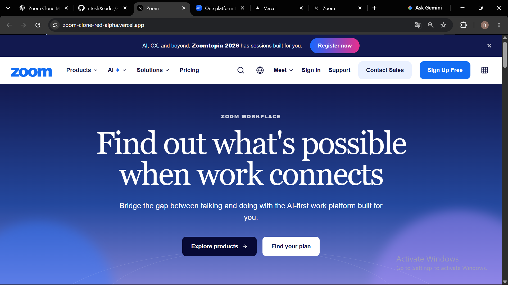
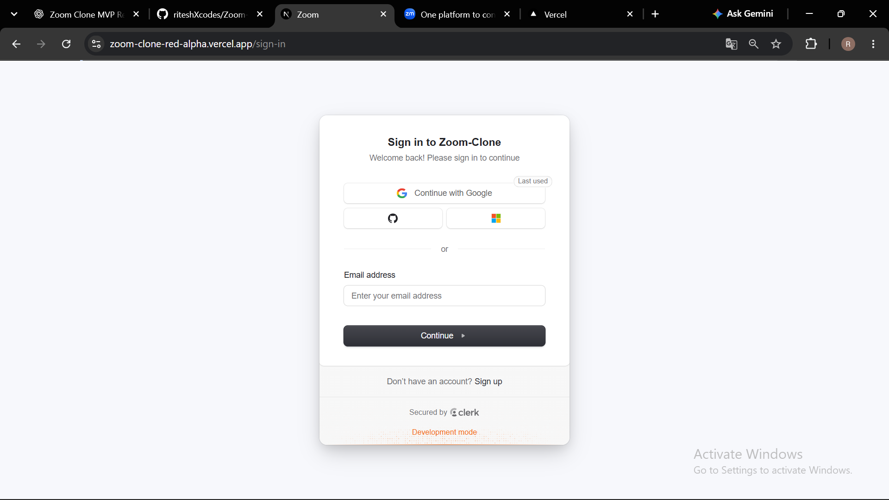
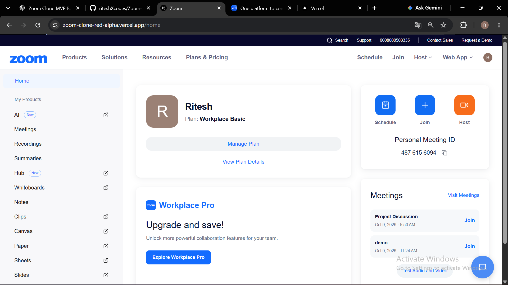
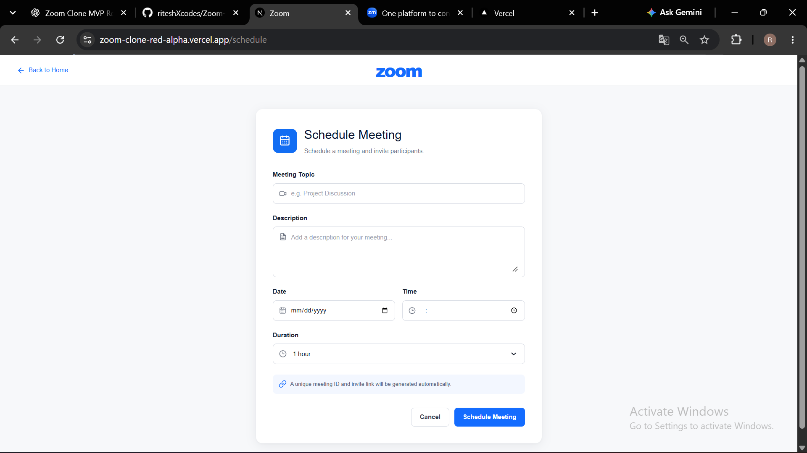
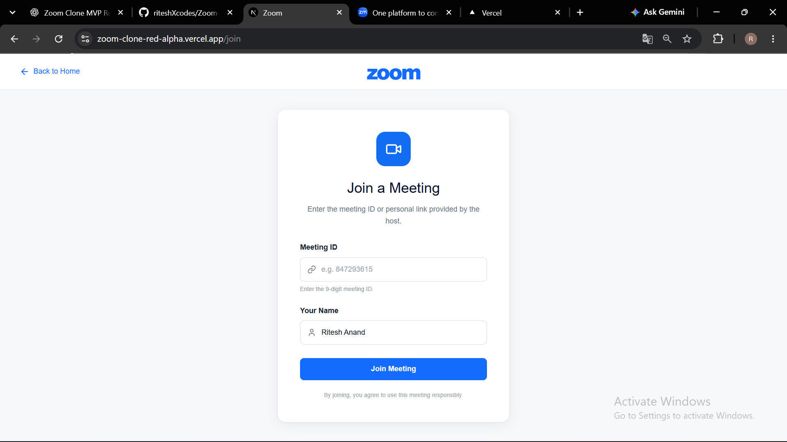
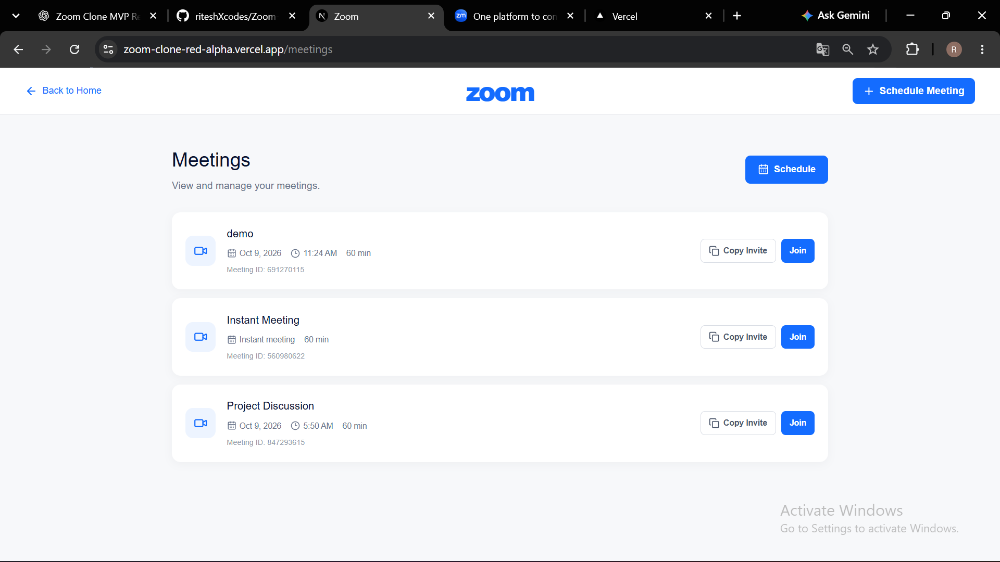
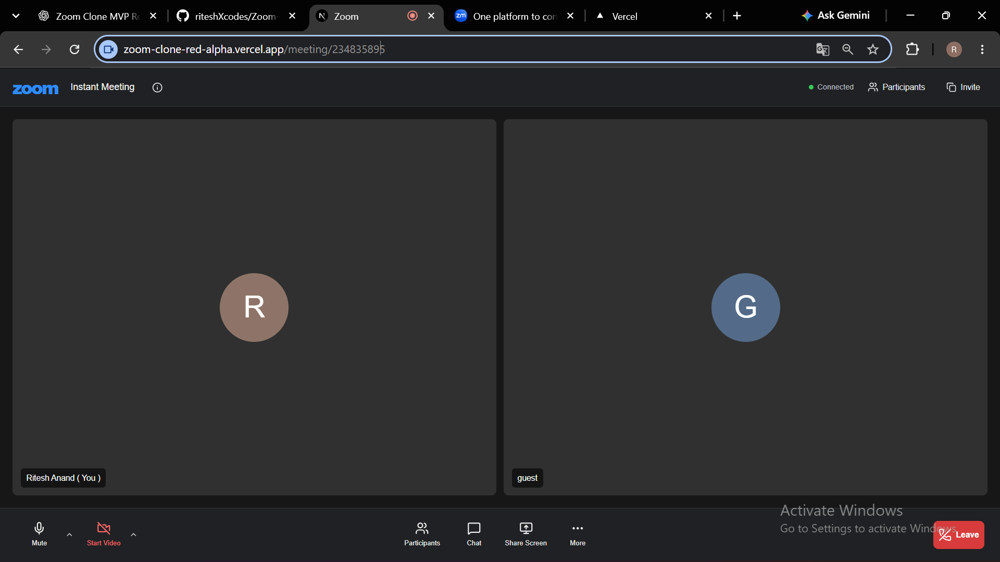
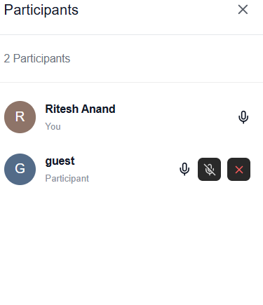

# Zoom Clone — Full-Stack Video Conferencing Platform

A full-stack video conferencing platform inspired by Zoom, built for the SDE Fullstack Assignment.

The project includes a public Zoom-style landing page, Clerk authentication, meeting creation and scheduling, SQLite persistence, real-time WebRTC audio/video, WebSocket signaling, participant management, chat, screen sharing, and host controls.

**Live App:** https://zoom-clone-red-alpha.vercel.app/  
**GitHub:** https://github.com/riteshXcodes/Zoom-Clone

---

## ✨ Highlights

- 🎨 Zoom-inspired public landing page
- 🔐 Clerk authentication
- ⚡ Instant meeting creation
- 🔗 Unique Meeting ID + shareable invite link
- 👤 Display-name based joining
- 📅 Meeting scheduling
- 🗄️ SQLite + SQLAlchemy database
- 🎥 Real-time WebRTC audio/video
- 🖥️ Screen sharing
- 💬 Real-time meeting chat
- 👥 Participant list and live participant state
- 🛡️ Host controls
- 📱 Responsive UI
- 🌐 Deployed frontend and backend

---

# 📸 Screenshots

> Project screenshots can be added to `docs/screenshots/` and referenced here.  
> The recommended screenshot set is listed below so the README documents the important user flows rather than only the homepage.

### Public Landing Page



### Authentication



### Dashboard



### Schedule Meeting



### Join Meeting



### Meetings / Recent Meetings



### Meeting Room



### Host Controls



> **Screenshot checklist:** Landing Page → Sign In → Dashboard → Schedule → Join → Meetings → Meeting Room → Host Controls.

---

# 🧩 Application Pages

| Route | Purpose |
|---|---|
| `/` | Public Zoom-inspired landing page |
| `/sign-in` | Clerk sign-in |
| `/sign-up` | Clerk sign-up |
| `/home` | Authenticated dashboard |
| `/join` | Join a meeting using Meeting ID |
| `/schedule` | Schedule a new meeting |
| `/meetings` | View meeting history / recent meetings |
| `/meeting/[meetingId]` | Real-time meeting room |

---

# 🚀 Core Features

## 1. Public Landing Page

The root route is a public Zoom-inspired marketing/landing page rather than opening directly on authentication.

It includes:

- Zoom-style navigation bar
- Products / AI / Solutions / Pricing navigation
- Sign In and Sign Up CTAs
- Hero section
- Product showcase
- AI / My Notes section
- Collaboration section
- Trusted-by section
- Customer stories
- News / updates section
- Final call-to-action
- Footer
- Responsive mobile layout

Authentication is entered through the **Sign In** or **Sign Up Free** actions.

---

## 2. Authentication

Authentication is implemented using **Clerk**.

- Sign in
- Sign up
- Protected application routes
- Authenticated API requests
- Clerk user identity mapped to backend users
- Public landing page remains accessible without authentication

---

## 3. Instant Meeting

Users can create a meeting instantly.

Flow:

```text
Dashboard
   ↓
New Meeting
   ↓
Backend generates unique Meeting ID
   ↓
Meeting record stored in SQLite
   ↓
Invite link generated
   ↓
Redirect to Meeting Room
```

Each meeting receives a unique numeric Meeting ID.

---

## 4. Join Meeting

Users can join an existing meeting by:

- Meeting ID
- Meeting invite URL

Before joining, the user provides a display name.

The backend validates that the meeting exists before the participant enters the meeting room.

---

## 5. Schedule Meeting

The scheduling page supports:

- Meeting title
- Description
- Date
- Time
- Duration

After scheduling:

- A unique Meeting ID is generated
- An invite link is generated
- The meeting is stored in SQLite
- The meeting appears in upcoming meetings

---

## 6. Meeting Room

The meeting room provides:

- Real-time video
- Real-time audio
- Multiple participants
- Camera toggle
- Microphone toggle
- Screen sharing
- Participant list
- Meeting information
- Copy invite link
- Real-time chat
- Leave meeting

The media layer is powered by WebRTC.

---

## 7. Host Controls

The application includes host-management functionality:

- Host identification
- Host badge
- Mute individual participant
- Remove participant
- Host transfer
- Host state synchronization

When the current host leaves, host responsibility can be transferred to another participant.

---

# 🗃️ Database Design

The project uses **SQLite** with **SQLAlchemy ORM**.

The current schema contains three main entities:

```text
┌──────────────┐
│     User     │
└──────┬───────┘
       │
       │ 1 : N
       ▼
┌──────────────┐
│   Meeting    │
└──────┬───────┘
       │
       │ 1 : N
       ▼
┌──────────────┐
│ Participant  │
└──────────────┘
```

## User

Stores application user information.

| Field | Type | Description |
|---|---|---|
| `id` | Integer | Primary key |
| `clerk_user_id` | String | Clerk user identifier |
| `name` | String | User name |
| `email` | String | User email |
| `avatar` | String | Avatar/initial |
| `created_at` | DateTime | Account creation timestamp |

## Meeting

Stores meeting information.

| Field | Type | Description |
|---|---|---|
| `id` | Integer | Primary key |
| `meeting_id` | String | Public unique Meeting ID |
| `title` | String | Meeting title |
| `description` | Text | Meeting description |
| `host_id` | Integer | Foreign key to User |
| `scheduled_at` | DateTime | Scheduled date/time; nullable for instant meetings |
| `duration` | Integer | Duration in minutes |
| `invite_link` | String | Shareable meeting path |
| `status` | String | Meeting status such as `scheduled` or `instant` |
| `created_at` | DateTime | Creation timestamp |

## Participant

Stores participants who join meetings.

| Field | Type | Description |
|---|---|---|
| `id` | Integer | Primary key |
| `meeting_id` | Integer | Foreign key to Meeting |
| `display_name` | String | Name displayed inside the meeting |
| `joined_at` | DateTime | Time the participant joined |
| `left_at` | DateTime | Time the participant left; nullable |

### Relationships

- One **User** can host multiple **Meetings**.
- One **Meeting** belongs to one host.
- One **Meeting** can have multiple **Participants**.
- Each **Participant** belongs to one meeting.
- Participant presence is tracked using `joined_at` and `left_at`.
- Clerk identity is stored on the User record using `clerk_user_id`.

---

# 🏗️ Architecture

```text
                    ┌─────────────────────┐
                    │    Next.js Frontend │
                    │  React + TypeScript │
                    └──────────┬──────────┘
                               │
                 ┌─────────────┴─────────────┐
                 │                           │
             REST API                    WebSocket
                 │                           │
                 ▼                           ▼
        ┌─────────────────────────────────────────┐
        │              FastAPI Backend            │
        │         Authentication + Signaling      │
        └──────────────────┬──────────────────────┘
                           │
                           ▼
                    ┌─────────────┐
                    │   SQLite    │
                    │ SQLAlchemy  │
                    └─────────────┘

              WebRTC
      Browser ↔ Browser
       Audio / Video
       Screen Sharing
```

### Communication responsibilities

**REST API**

- Create meetings
- Schedule meetings
- Validate meetings
- Join meetings
- Fetch upcoming meetings
- Fetch recent meetings

**WebSockets**

- WebRTC signaling
- Participant join/leave events
- Chat
- Camera state
- Microphone state
- Host controls
- Host transfer

**WebRTC**

- Peer-to-peer audio
- Peer-to-peer video
- Screen sharing

---

# 🛠️ Tech Stack

## Frontend

- Next.js
- React
- TypeScript
- CSS
- Lucide React
- Clerk

## Backend

- Python
- FastAPI
- SQLAlchemy
- Uvicorn
- WebSockets

## Database

- SQLite
- SQLAlchemy ORM

## Real-Time Communication

- WebRTC
- WebSockets

## Deployment

- Vercel — Frontend
- Render — Backend

---

# 📁 Project Structure

```text
zoom-clone/
│
├── backend/
│   ├── routers/
│   │   └── meetings.py
│   ├── auth.py
│   ├── crud.py
│   ├── database.py
│   ├── main.py
│   ├── models.py
│   ├── schemas.py
│   └── requirements.txt
│
├── frontend/
│   ├── app/
│   │   ├── home/
│   │   ├── join/
│   │   ├── meeting/
│   │   ├── meetings/
│   │   ├── schedule/
│   │   ├── sign-in/
│   │   ├── sign-up/
│   │   ├── page.tsx
│   │   ├── layout.tsx
│   │   └── globals.css
│   ├── public/
│   ├── package.json
│   └── tsconfig.json
│
└── README.md
```

---

# ⚙️ Local Setup

## Requirements

Install:

- Node.js
- npm
- Python 3.x
- Git
- Modern browser

Check versions:

```bash
node --version
npm --version
python --version
git --version
```

## 1. Clone

```bash
git clone https://github.com/riteshXcodes/Zoom-Clone.git
cd Zoom-Clone
```

## 2. Backend

```bash
cd backend
python -m venv venv
```

Windows:

```bash
venv\Scripts\activate
```

Install:

```bash
pip install -r requirements.txt
```

Configure the required environment variables, including the Clerk secret key.

Start:

```bash
uvicorn main:app --reload
```

Backend:

```text
http://127.0.0.1:8000
```

FastAPI docs:

```text
http://127.0.0.1:8000/docs
```

## 3. Frontend

Open another terminal:

```bash
cd frontend
npm install
npm run dev
```

Frontend:

```text
http://localhost:3000
```

---

# 🔄 Main User Flow

```text
                    Public Landing Page
                            │
                  ┌─────────┴─────────┐
                  │                   │
               Sign In             Sign Up
                  │                   │
                  └─────────┬─────────┘
                            ▼
                        Dashboard
                            │
          ┌─────────────────┼─────────────────┐
          │                 │                 │
          ▼                 ▼                 ▼
     New Meeting       Join Meeting       Schedule
          │                 │              Meeting
          └─────────────────┼─────────────────┘
                            ▼
                      Meeting Room
                            │
        ┌───────────┬───────┼────────┬───────────┐
        ▼           ▼       ▼        ▼           ▼
      Video       Audio   Chat    Screen     Participants
                                   Share
```

---

# 🧪 Testing Checklist

The following flows are supported/tested during development:

- Public landing page
- Sign in / sign up
- Protected dashboard
- Instant meeting creation
- Unique Meeting ID generation
- Invite link generation
- Meeting validation
- Display name
- Meeting scheduling
- Upcoming meetings
- Recent meetings
- Audio/video
- Multiple participants
- Microphone control
- Camera control
- Screen sharing
- Participant list
- Chat
- Host identification
- Participant mute
- Participant removal
- Host transfer
- Leave meeting

---

# 📋 Assignment Coverage

| Requirement | Status |
|---|---|
| Public landing page | ✅ |
| Authentication | ✅ Bonus |
| Dashboard | ✅ |
| New / Instant Meeting | ✅ |
| Unique Meeting ID | ✅ |
| Shareable Invite Link | ✅ |
| Join by Meeting ID | ✅ |
| Meeting validation | ✅ |
| Display Name | ✅ |
| Schedule Meeting | ✅ |
| Title / Description | ✅ |
| Date / Time | ✅ |
| Duration | ✅ |
| SQLite database | ✅ |
| Upcoming Meetings | ✅ |
| Recent Meetings | ✅ |
| Audio / Video | ✅ |
| Multiple Participants | ✅ |
| Screen Sharing | ✅ |
| Chat | ✅ |
| Responsive UI | ✅ Bonus |
| Host Controls | ✅ Bonus |

---

# 🎯 Design Philosophy

The application intentionally follows the visual language of modern Zoom:

- Clean white marketing pages
- Zoom blue primary actions
- Dark meeting-room interface
- Large video tiles
- Bottom meeting controls
- Participant side panel
- Clear meeting information
- Responsive layouts
- Simple meeting workflows

The implementation is an independent project inspired by Zoom's product experience and is not affiliated with Zoom Video Communications.

---

# 👨‍💻 Author

**Ritesh Anand**

SDE Fullstack Assignment — Zoom Clone

